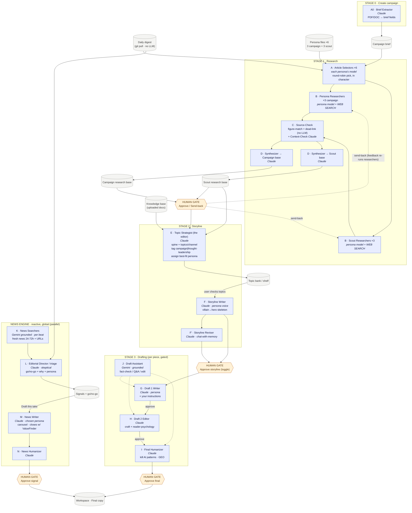

# ContentOS — Agent Flowchart

> Open in Obsidian (or any Mermaid viewer) to see the rendered diagram.
> Blue = AI agent · Grey = data store · Amber = human gate.

## Model backbone (how each agent reaches an LLM)
- **Claude** (Azure) — most reasoning/writing agents; optional web_search.
- **Gemini** (Vertex) — grounding always on; also the live-search backend.
- **Grok / DeepSeek** (Azure, OpenAI-compat) — `web_search` fulfilled by Gemini grounding (hybrid).
- **Router** `callModel()` selects the backend by the persona's `model:` field.

Personas → model: Auditor=Claude · Doctor=Gemini · Policy Insider=Grok · Feed/Interviewer/AI-for-Humans=Gemini.
